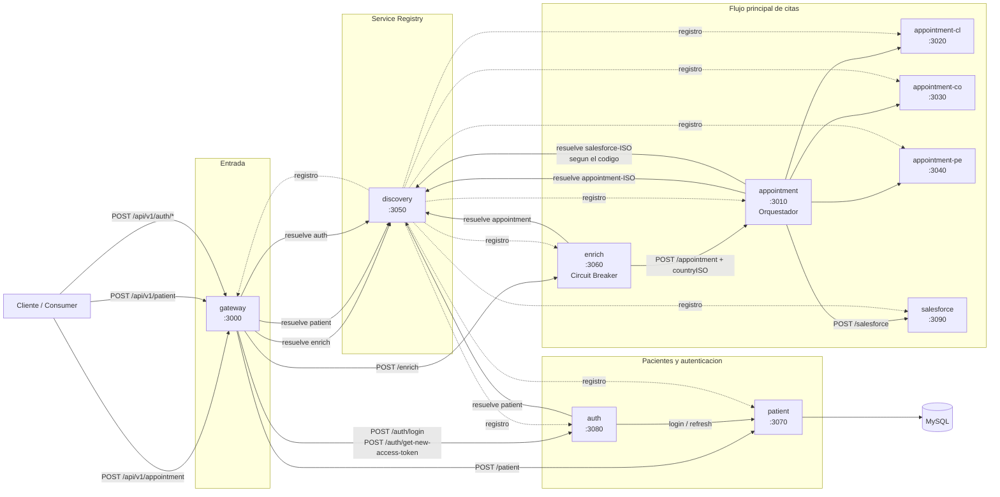

# Microservicios_Group18

## Arquitectura de microservicios

Revisión del monorepo en `project/apps`:

- `gateway` (`3000`): punto de entrada HTTP. Deriva operaciones hacia `enrich`, `patient` y `auth`.
- `discovery` (`3050`): registro de servicios, resolución por nombre, heartbeats y health checks.
- `enrich` (`3060`): agrega el `countryISO` y protege la llamada a `appointment` con circuit breaker.
- `appointment` (`3010`): orquestador de citas. Resuelve un servicio regional de `appointment` y luego notifica a `salesforce`.
- `appointment-cl` (`3020`), `appointment-co` (`3030`), `appointment-pe` (`3040`): implementaciones regionales del endpoint de citas.
- `patient` (`3070`): alta de pacientes, login y refresh token. Persiste en MySQL.
- `auth` (`3080`): fachada de autenticación; delega login y refresh token al servicio `patient`.
- `salesforce` (`3090`): endpoint de integración externa para registrar el evento posterior a la cita.

## Observaciones de la revisión

- Todos los servicios, salvo `discovery`, se registran en `discovery` al iniciar y envían heartbeat periódico.
- `patient` es el único microservicio con dependencia directa de base de datos; usa MySQL configurado en `project/compose.yml`.
- `appointment` selecciona el destino regional usando `countryISO` (`CL`, `CO`, `PE`).
- Hay una discrepancia en el código actual: `appointment` intenta resolver `salesforce-{iso}` en `discovery`, pero en el repositorio sólo existe un microservicio `salesforce` y su `.env` registra el nombre `salesforce`.
